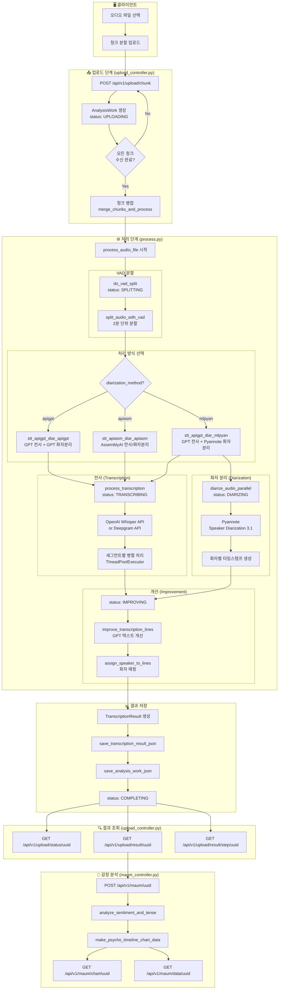
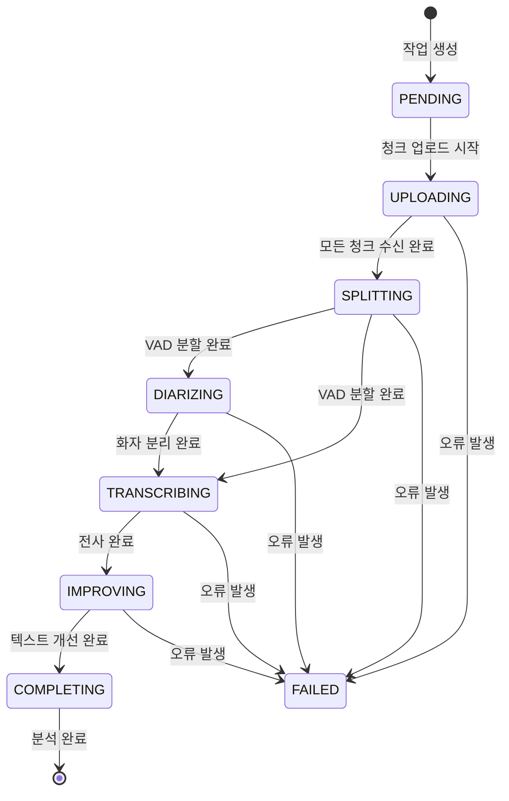
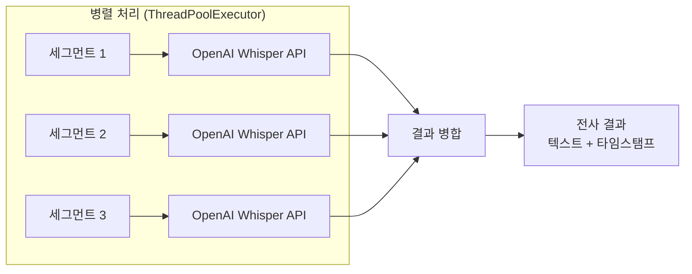
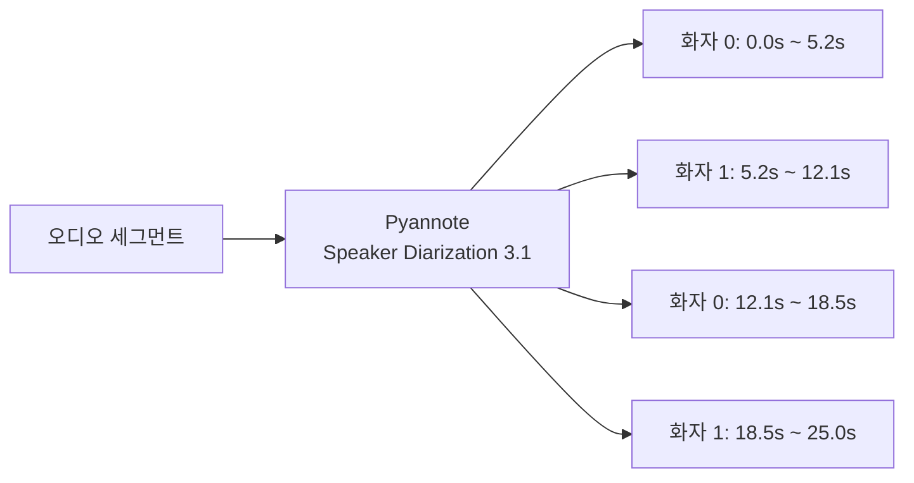

# MAVO 음성 분석 플로우 가이드

## 📋 개요

MAVO는 음성 파일을 업로드하고, 전사(STT), 화자 분리(Diarization), 텍스트 개선, 감정 분석을 수행하는 시스템입니다.

---

## 🔄 전체 처리 플로우



---

## 📊 상태 흐름 (AudioStatus)



---

## 📁 주요 파일 및 역할

| 파일 | 역할 |
|------|------|
| `backend/controllers/upload_controller.py` | 파일 업로드 및 결과 조회 API |
| `backend/controllers/maum_controller.py` | 감정/심리 분석 API |
| `backend/logic/voice_analysis/process.py` | 핵심 처리 로직 (전사, 화자분리, 개선) |
| `backend/logic/models.py` | 데이터 모델 (AnalysisWork, AudioStatus, Segment) |
| `backend/logic/transcript_analysis/transcript_analysis_util.py` | 텍스트 분석 유틸 |

---

## 🔧 단계별 상세 설명

### 1️⃣ 업로드 단계 (UPLOADING)

**엔드포인트**: `POST /api/v1/upload/chunk`

```
클라이언트 ──청크1──> 서버
클라이언트 ──청크2──> 서버
클라이언트 ──청크N──> 서버 ──병합──> 완성된 오디오 파일
```

- 대용량 파일을 여러 청크로 분할하여 업로드
- 각 청크는 `temp/uploading/{uuid}/` 디렉토리에 저장
- 모든 청크 수신 완료 시 `merge_chunks_and_process()` 호출
- `AnalysisWork` 객체 생성하여 작업 상태 관리

### 2️⃣ VAD 분할 단계 (SPLITTING)

**함수**: `do_vad_split(analysis_job)`

```
원본 오디오 (10분)
    │
    ├──> 세그먼트 1 (2분) ──> temp/splits/uuid/seg_0.wav
    ├──> 세그먼트 2 (2분) ──> temp/splits/uuid/seg_1.wav
    ├──> 세그먼트 3 (2분) ──> temp/splits/uuid/seg_2.wav
    ├──> 세그먼트 4 (2분) ──> temp/splits/uuid/seg_3.wav
    └──> 세그먼트 5 (2분) ──> temp/splits/uuid/seg_4.wav
```

- **VAD** (Voice Activity Detection): 음성이 있는 구간만 감지
- 기본 2분(120초) 단위로 오디오 분할
- 무음 구간에서 자연스럽게 분할하여 문장 끊김 방지

### 3️⃣ 처리 방식 선택

| 방식 | STT | 화자분리 | 설명 |
|------|-----|----------|------|
| `stt_apigpt_diar_apigpt` | OpenAI GPT | OpenAI GPT | GPT로 전사+화자 추론 |
| `stt_apiasm_diar_apiasm` | AssemblyAI | AssemblyAI | AssemblyAI 통합 사용 |
| `stt_apigpt_diar_mlpyan` | OpenAI GPT | Pyannote | GPT 전사 + ML 화자분리 (기본) |
| `stt_apigpt_diar_mlpyan2` | OpenAI GPT | Pyannote | 병렬 처리 최적화 버전 |

### 4️⃣ 전사 단계 (TRANSCRIBING)

**함수**: `process_transcription(analysis_job, split_segments)`



- **병렬 처리**: `ThreadPoolExecutor`로 여러 세그먼트 동시 처리
- **API 선택**: OpenAI Whisper API 또는 Deepgram API
- **출력**: 각 단어/문장의 시작/종료 시간 포함

### 5️⃣ 화자 분리 단계 (DIARIZING)

**함수**: `diarize_audio_parallel(analysis_job, split_segments)`



- **Pyannote Audio**: HuggingFace 기반 화자 분리 모델
- 각 구간에 화자 ID (SPEAKER_00, SPEAKER_01 등) 부여
- 세그먼트별 화자 수 자동 조정

### 6️⃣ 개선 단계 (IMPROVING)

**함수**: `improve_transcription_lines()`, `assign_speaker_to_lines_with_gpt()`

```
원본: "어 그래서 저는 음 그니까..."
      ↓ GPT 텍스트 개선
개선: "그래서 저는 그러니까..."
      ↓ 화자 매핑
최종: "[화자 0] 그래서 저는 그러니까..."
```

- **텍스트 개선**: 필러워드 제거, 문장 정리
- **화자 매핑**: 전사 결과와 화자분리 결과 결합
- 동일 화자 연속 발화 병합

### 7️⃣ 결과 저장 (COMPLETING)

**저장 위치**: `uploads/{uuid}/`

```
uploads/{uuid}/
├── id[{uuid}]_transcript.json      # 전체 전사 결과
├── id[{uuid}]_ml_diarized.json     # 화자 분리 결과
├── id[{uuid}]_consecutive_segments.json  # 연속 세그먼트
└── analysis_job.json               # 작업 메타데이터
```

---

## 🔍 결과 조회 API

### 상태 조회
```bash
GET /api/v1/upload/status/{uuid}
```

**응답 예시**:
```json
{
  "audio_uuid": "abc123",
  "status": "COMPLETING",
  "progress": {
    "steps": [
      {"step_name": "splitting", "status": "completed"},
      {"step_name": "transcribing", "status": "completed"},
      {"step_name": "improving", "status": "completed"}
    ],
    "percent_complete": 100
  }
}
```

### 결과 조회
```bash
GET /api/v1/upload/result/{uuid}
```

**응답 예시**:
```json
{
  "audio_uuid": "abc123",
  "segments": [
    {
      "id": 0,
      "start": 0.0,
      "end": 5.2,
      "text": "안녕하세요, 오늘 상담 시작하겠습니다.",
      "speaker": 0
    },
    {
      "id": 1,
      "start": 5.5,
      "end": 12.1,
      "text": "네, 감사합니다.",
      "speaker": 1
    }
  ],
  "speakers": [
    {"id": 0, "role": "counselor"},
    {"id": 1, "role": "client"}
  ]
}
```

---

## 🧠 감정 분석 (Maum Analysis)

### 분석 실행
```bash
POST /api/v1/maum/{uuid}
```

### 분석 내용

| 분석 항목 | 설명 |
|-----------|------|
| 발화 속도 (Cadence) | 화자별 분당 발화 속도 |
| 감정 분석 (Sentiment) | 긍정/부정 감정 수치 |
| 시제 분석 (Tense) | 과거/현재/미래 초점 비율 |
| 타임라인 차트 | 시간별 심리 상태 시각화 |

### 결과 조회
```bash
# 차트 이미지
GET /api/v1/maum/chart/{uuid}

# 분석 데이터 (JSON)
GET /api/v1/maum/data/{uuid}
```

---

## 📝 데이터 모델

### AnalysisWork
```python
class AnalysisWork:
    id: str                    # UUID
    filename: str              # 원본 파일명
    status: AudioStatus        # 현재 상태
    steps: List[Dict]          # 단계별 진행 정보
    options: Dict              # 처리 옵션
    result: TranscriptionResult # 최종 결과
    error: Optional[str]       # 에러 메시지
```

### AudioStatus (Enum)
```python
class AudioStatus(str, Enum):
    PENDING = "pending"
    UPLOADING = "uploading"
    SPLITTING = "splitting"
    DIARIZING = "diarizing"
    TRANSCRIBING = "transcribing"
    IMPROVING = "improving"
    COMPLETING = "completing"
    FAILED = "failed"
```

### Segment
```python
class Segment:
    id: int           # 세그먼트 ID
    start: float      # 시작 시간 (초)
    end: float        # 종료 시간 (초)
    text: str         # 전사된 텍스트
    speaker: int      # 화자 ID
```

---

## ⚡ 성능 최적화 포인트

1. **청크 업로드**: 대용량 파일 네트워크 안정성 확보
2. **VAD 분할**: 처리 단위 최적화 (2분)
3. **병렬 처리**: `ThreadPoolExecutor`로 세그먼트 동시 처리
4. **비동기 실행**: 백그라운드 스레드에서 처리 (`daemon=True`)
5. **결과 캐싱**: JSON 파일로 중간 결과 저장 및 재사용

---

## 🚀 빠른 시작

```bash
# 1. 서버 실행
./run.sh

# 2. Swagger UI 접속
open http://localhost:25500/doc

# 3. 파일 업로드 테스트
curl -X POST "http://localhost:25500/api/v1/upload/chunk" \
  -F "file=@audio.m4a" \
  -F "audio_uuid=test-uuid-123" \
  -F "chunk_index=0" \
  -F "total_chunks=1" \
  -F "original_filename=audio.m4a"

# 4. 상태 확인
curl "http://localhost:25500/api/v1/upload/status/test-uuid-123"

# 5. 결과 조회
curl "http://localhost:25500/api/v1/upload/result/test-uuid-123"
```

---

## 📚 참고

- [OpenAI Whisper API](https://platform.openai.com/docs/guides/speech-to-text)
- [Pyannote Speaker Diarization](https://huggingface.co/pyannote/speaker-diarization-3.1)
- [AssemblyAI](https://www.assemblyai.com/docs)
- [Deepgram](https://developers.deepgram.com/)
